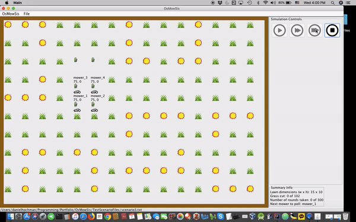

# Welcome to Daniel Hochman's programmer portfolio

This is a GitHub account I've set up for the purpose of showcasing my programming projects. Here, you will find both finished projects as well as projects that I am currently working on. As most of the projects are private repositories, I've included login credentials at the top my resume for you to login with in order to access these projects (if you're interesting is looking at the source code).

Currently, I have two projects that I am excited to show you and talk to you about:

1). [OsMowSis](https://github.com/potentialEmployer77/OsMowSisHome): A simulation program of an automated lawn-mowing system whereby a cohort of robotic lawn mowers is placed on a lawn and must scan and move around the lawn in order to cut all the grass, while also avoiding crashing into various types of obstacles on the lawn. This project was written in Java using the Swing GUI toolkit. Short video demonstration available [here](https://youtu.be/65dBQBcDRs4).

2). [SpotBook](https://github.com/potentialEmployer77/SpotBookHome): An Android app for storing and organizing skateboard spots (places to skateboard). Allows users to easily save, search, and share their favorite spots. This app is currently being beta tested and can be downloaded through the following Firebase App Distribution [invitation link](https://youtu.be/jxqs0F_ICZM). Video demonstration available [here](https://youtu.be/jxqs0F_ICZM).

Thank you for your time and consideration and I look forward to hearing from you!

